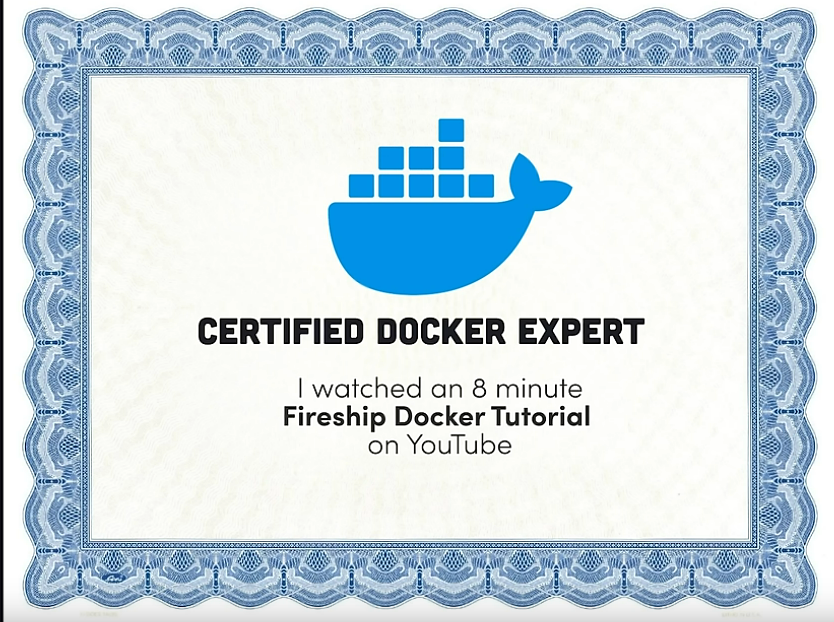

I love VPN and proxy software.

- [TompHTTP/The Bare server](https://github.com/tomphttp/bare-server-node)
- [Ultraviolet](https://github.com/titaniumnetwork-dev/Ultraviolet)
- [Holy Unblocker](https://github.com/holywebwork/website2)

I also like to mess with Chromebooks.

- [chrome100](https://github.com/e9x/chrome100)

